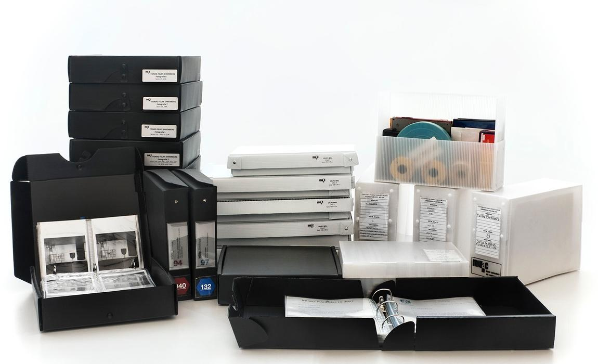
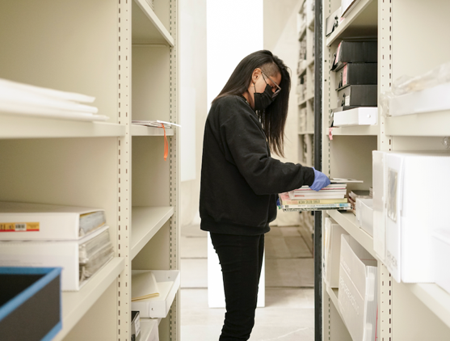
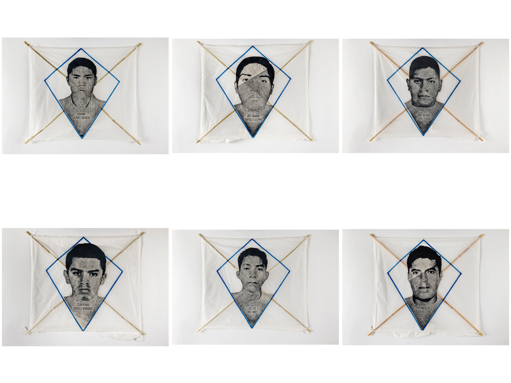
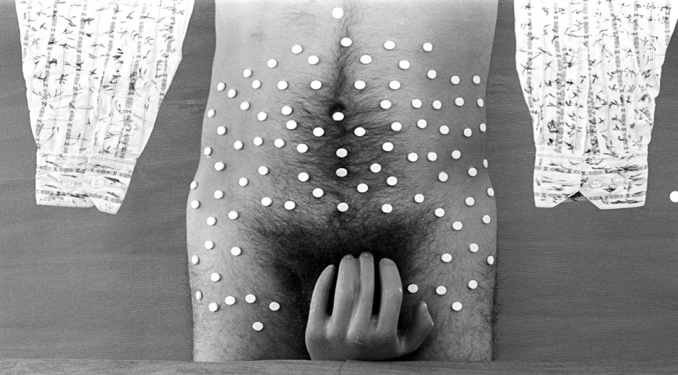

---
date: Mayo 30, 2022
eje: 'Memoria y olvido en las políticas de documentación: ¿Qué y cómo seleccionamos, conservamos, sistematizamos y difundimos?'
title: '¿NO HAY MEMORIA SIN SAQUEO?'
author:
    name: Sol Henaro
    affiliation: UNAM
...
El título es una provocación, lo tomé prestado de un diálogo de la película *Museo* (Alonso Ruizpalacios, 2018) que retoma el robo en 1985 de varias piezas patrimoniales de origen maya y azteca en el Museo Nacional de Antropología e Historia de la Ciudad de México. En una de las escenas uno de los protagonistas afirma "no hay memoria sin saqueo", y partir de entonces esa frase apareció como una interpelación constante en mis reflexiones, pero con signos de interrogación: ¿acaso no hay memoria sin saqueo?

Llevar el cuestionamiento a las prácticas vinculadas con políticas de la memoria arrojó matices y reflexiones en torno a los límites éticos, a la relatividad de las justificaciones y la violencia o pertinencia que puede suponer la recuperación de prácticas, agencias, residuos o producciones. Como en todo -me parece- depende desde dónde, para qué y cómo se lleva a cabo el desplazamiento o integración. ¿Qué tipo de escenario de acción articulamos y qué estrategias o coreografías de sentido proyectamos para lograr nuestro(s) propósito(s)? ¿Qué políticas de confianza generamos y qué disposición autocrítica aplicamos a nuestras prácticas profesionales en torno a legados documentales?. Desde luego, la interrogante vertebra muchas de nuestras reflexiones habituales desde el Centro de Documentación Arkheia MUAC (DiGAV-UNAM) y nuestro quehacer como investigadores, archivistes-archiveres, custodies y como agentes que articulan, producen y facilitan información e intervienen en las políticas de la memoria.

{width="5.228074146981627in" height="3.1777252843394574in"}

Situemos desde dónde operamos. El Centro de Documentación Arkheia surgió en la base del proyecto museológico para dar origen al MUAC, el Museo Universitario Arte Contemporáneo que abrió puertas en el sur de la Ciudad de México en 2008. Entre el cuerpo colegiado que intervino en su concepción destaca la voz de Oliver Debroise, historiador, crítico y curador sobresaliente y muy querido que lamentablemente falleció poco antes de inaugurar el museo. Olivier planteo modificaciones sustantivas en relación a la Colección MUAC y pertinentemente, en torno a los acervos documentales. Tuvo a bien generar un lugar y un estatuto de igualdad entre los acervos artísticos y los documentales que como muchos de ustedes saben tienden o tendían a ser secundarizados es decir, Debroise objetó la tradición de entender como bien principal a la obra artística y como algo complementario o accesorio al documento o al archivo. Aunado a ello también amplió el radio de interés reconociendo la relevancia de archivos no únicamente generados por artistas sino de aquellos provenientes de una comunidad amplia que participa activamente en la práctica artística: críticos, historiadores, museólogos, museógrafos, espacios independientes entre otros agentes que intervienen en la producción y circulación artística/cultural.

{width="3.3585137795275593in" height="2.517491251093613in"}

Concebido como un espacio de servicio público, Arkheia comprende la biblioteca (acervo bibliográfico) y los fondos y colecciones documentales (acervo documental) con el objetivo de ampliar y fortalecer el relato historiográfico de la práctica artística en México a partir de la década de los sesenta. Entre sus servicios ofrece consulta de insumos bibliográficos y documentales, brinda asesoría sobre sus fondos y colecciones, facilita préstamos del acervo para exposiciones nacionales e internacionales, archivos digitales para uso académico y de difusión además de participar activamente en los contextos y enclaves a los que es convocada la equipa para presentar el proyecto o reflexionar en relación a políticas de la memoria. Si bien el compromiso con la cultura material y la preservación es nodal, consideramos la consulta pública también como una estrategia de activación y preservación de la memoria y de los materiales mismos. Aunado al compromiso de servicio público apostamos por contrarrestar la idea tergiversada de que los archivos son lugares aburridos o para públicos metaespecializados y por ello, con el interés de convocar a nueves usuaries, nos apetece preguntarnos por cómo hacer "más sexy al archivo" en tanto seducir y acercar a nueves usuaries.

Nuestro primer fondo documental es el Fondo Histórico MUCA que recoge precisamente la historia de la institución que nos precede y de la cual heredamos su colección: el Museo Universitario de Ciencias y Arte de la UNAM, cuya gestión se mantuvo activa desde finales de los años cincuenta hasta la apertura en 2008 del nuevo museo, el MUAC. A partir de ese primer archivo hemos podido sumar al día de hoy un total de 56 fondos documentales más tres colecciones documentales; a cada uno de estos continentes de sentido se les aplica un conjunto de tratamientos para poder extender su vida y garantizar su acceso público: procesos de estabilización y restauración, catalogación, foliado, producción de guardas, traslado a guardas, digitalización, reprografía, difusión...

![\[Aspectos de labores cotidianas\] Centro de Documentación Arkheia MUAC (DiGAV-UNAM)Foto: Giovanna Enríquez](08/image4.png){width="2.848611111111111in" height="1.8895833333333334in"}

{width="2.532471566054243in" height="1.9201793525809274in"}

Entendiendo la responsabilidad sobre estos legados, el MUAC ha impulsado desde su inicio la elaboración de políticas y lineamientos con el propósito de profesionalizar y garantizar la correcta preservación de los mismos. De igual modo de manera interna, el CDArkheia ha producido lineamientos y su manual de procedimientos para contribuir a una cultura de estructuración, estudio y revisión de los procesos que hay que tener en cuenta y actualizar periódicamente. Desde luego reconociendo que sigue siendo un ámbito en proceso de profesionalización, el de los archivos vinculados a práctica artística desde la institución museística, atendemos constantemente capacitaciones, visitas a otros acervos, conversaciones con colegas y mantenemos periódicamente un seminario interno para socializar y evaluar colectivamente las necesidades, límites y complejidades varias que supone nuestro quehacer cotidiano.

Uno de los proyectos que ha generado particular atención sobre el MUAC es las exposiciones de archivo que lleva a cabo, una estrategia que permite socializar y generar entramados curatoriales a partir de diversos materiales documentales provenientes de diversos fondos y colecciones principalmente del Centro de Documentación Arkheia con algunos préstamos externos procedentes de otros archivos o colecciones. Las exposiciones de archivo, como todo ejercicio de investigación y/o curaduría, pide administrar el deseo para priorizar materiales y nos permite ensayar diversos modelos de emplazamiento museográfico que intentan convocar lenguajes contemporáneos, lúdicos y propositivos que contrarresten la usual percepción de las exposiciones de archivo como experiencias soporíferas para el/la visitante[^1].

![\[Vista de la exposición: *Arte acción en México, registros y residuos.* 2019\]Cortesía: Museo Universitario Arte Contemporáneo, MUAC (DiGAV-UNAM)](08/image7.jpg){width="5.216305774278215in" height="2.93254593175853in"}

¿Y qué es lo que mapeamos y conservamos para el Patrimonio Universitario? Esto sin duda es algo muy importante. El Museo Universitario Arte Contemporáneo --dónde tiene lugar el Centro de Documentación Arkheia-- es una dependencia de la Dirección General de Artes Visuales de la UNAM y la responsabilidad de generar un enunciado de memoria colegiado, académico y público resulta esencial, por ello inscribimos las obras y documentos ante la Dirección General de Patrimonio Universitario de la UNAM. Esta operación garantiza la correcta preservación de los archivos y la imposibilidad de volver a ser enajenados y se les ampara contra decisiones individuales que puedan vulnerarles o ponerle en peligro. Aún con lo descrito, tenemos cierta resistencia a definir nuestro trabajo como "rescate". Nos sentimos menos identificados con esa dimensión heroica y mucho más afines a la responsabilidad política de nuestra práctica. Nosotros no estamos descubriendo nada en tanto que las agencias convocadas al archivo existen y han marcado probadamente determinado(s) impacto(s) en el desarrollo del arte en México, lo que hacemos desde la institución es girar el reflector para lanzar luz sobre aquello que ha estado ahí, "abrir el pliegue de la memoria" y sumarnos a operaciones de restitución de sentido. Desde luego, y aunque lo considero una obviedad, no sobra decir que no creemos en la existencia de un relato total, pensamos más en microrrelatos que en una Historia del Arte fija y cerrada.

¿Cómo, quién y con qué objetivo(s) se recuperan prácticas? No es posible abordar aquí la singularidad de cada uno de los fondos y colecciones documentales que custodiamos por lo que señalaré específicamente dos casos a modo de ejemplo. Si bien cada archivo que integramos a la colección documental implica un proceso de investigación y un periplo administrativo complejo, resulta mucho más común el convocar fondos o archivos existentes que generar colecciones documentales que no han sido articuladas o incluso ni siquiera pensadas previamente. Nosotros nos sometimos voluntariamente a un proceso complicado e inusual al proponernos como un centro de documentación activo en la conformación de legados documentales que consideramos inaplazables: *Colección visualidades y movilización social* y *Colección visualidades y VIH en México.*

Cuando asumí el Centro de Documentación Arkheia en 2015 habían pasado muy pocos meses de la ominosa desaparición de los 43 estudiantes de la escuela Normal Rural Raúl Isidro Burgos de Ayotzinapa, Guerrero. En medio de la rabia, dolor e indignación que suscitó este hecho me preguntaba cómo participar activamente del enjambre enardecido; de igual modo, de manera concomitante se discutía sobre la Ley General de Archivos que entraría en vigencia y cuya tutela estaba en riesgo de asignarse a la Secretaría de Gobernación, lo cual levantaba suspicacias sobre posibles borramientos, obstáculos para acceder a archivos y materiales así como testeos indiscriminados articulados desde intereses promovidos por El Estado. En ese enclave de tensión radical propuse al *Comité de Adquisiciones de obra artística y documental MUAC* la autorización para poner en marcha una colección en proceso que permitiera reunir y resguardar diversos residuos heterogéneos de cultura visual producida para acompañar o intervenir en movilizaciones sociales.[^2] Conformada por materiales producidos tanto por civiles, activistas, diseñadores y artistas, la colección no pretende ser exhaustiva y si en cambio sacudir los límites de la institución, de lo que corresponde o no a un museo de arte contemporáneo y convocar a la corresponsabilidad en torno a las memorias.

Para destacar un material de la *Colección visualidades y movilización social* propongo los *Papalotes de los desaparecidos* que el artista y activista oaxaqueño Francisco Toledo produjo con los rostros de los 43 estudiantes desaparecidos retomando una tradición de origen zapoteca que vincula tierra y cielo a través de la cola de las cometas (papalote[^3]). Dándolos a volar a niños en la calle, Toledo lanzó una imagen poética poderosa al narrar que "como a los estudiantes de Ayotzinapa los habían buscado ya bajo tierra y en el agua, enviamos los papalotes a buscarlos al cielo"[^4].

{width="4.571827427821522in" height="3.430515091863517in"}

Como es imaginable, la operación de reunir residuos de origen heterogéneo vinculados con la cultura visual de movilizaciones no se encuentra exenta de problemas y tensiones. Desde el comienzo nos cuestionamos si con ese ejercicio el museo cooptaba, neutralizaba o potenciaba; nos planteamos preguntas como estas para lejos de actuar de modo *naif*, hacernos cargo de la controversia que podría suscitar y entender cuál era la responsabilidad de un museo universitario al respecto. En el entendido de que era necesario correr los riesgos y no abonar a la postergación de articular esos legados, poco más tarde dimos inicio a la segunda estrategia documental que nombramos *Colección visualidades y VIH en México*. Tuvimos mucho cuidado de no convocar en ninguna de estas dos colecciones en proceso la palabra "arte" y dejarlo en un marco amplio de "visualidades" para, desde esa elasticidad, convocar una pluralidad de materiales sin la limitación o apelar a dicha categoría.

Para el segundo repertorio parcial tomamos como referencia iniciativas que nos antecedían como el *Anarchivo Sida*, impulsado desde el territorio español por el Equipo Re[^5]. El detonador para llevarlo a cabo fue el deseo de acompañamiento a un afecto cercano diagnosticado con VIH y cuya experiencia me enfrentó a cuestionarme sobre mi conocimiento anquilosado o desactualizado en relación a la pandemia del VIH, a recordar la prolija producción cultural que circuló en los años ochenta y noventa en México en relación a la crisis del sida y a considerar la urgencia de volver a traer el tema en la esfera pública específicamente desde un museo universitario cuyos públicos son principalmente jóvenes. En este caso además de dar inicio a la colección pudimos concretar una exposición, su programa público y una publicación que, a raíz de haber cerrado al mes por la llegada de la nueva pandemia COVID 19, tradujimos y adaptamos para socializar los contenidos a través de un micrositio en línea[^6]. Fue muy estimulante, dentro de lo inquietante que fue producir contenidos y mantener investigaciones a distancia durante la pandemia, notar las bondades que ofrecen los micrositios como herramienta poderosa y útil para acervos documentales en tanto que favorece tiempo de consumo, lectura y de ingresar a revisar los materiales cuantas veces requiera el/la usuarie independientemente del contexto geográfico desde el cual acceda, aspecto que muchas veces las exposiciones *in situ* no necesariamente facilitan. En este caso también aparecieron cuestionamientos al interior de la equipa sobre a quien le correspondía hacer un relato de memoria sobre el VIH, dónde colocarnos --en mi caso desde mi condición de no VIH positiva--, cómo implicarnos con las comunidades involucradas y cómo entender el proyecto desde el acompañamiento solidario, político y en corresponsabilidad con generar, reunir y difundir legados documentales al respecto y en proceso.

{width="3.9494378827646544in" height="2.1848993875765528in"}

La(s) memoria(s) está(n) en disputa. Pero quizás no radique ahí necesariamente el mayor problema sino en lo que nos preguntamos, replanteamos y proponemos hacer al respecto. Las decisiones que tomamos afectan, intervienen, construyen, desplazan... Las memorias son sensibles. Convoco discusiones actuales, pero no nuevas, en relación al monumento: recordé específicamente una imagen emblemática de 1992 cuando derribaron la estatua del capitán español Diego de Mazariegos en San Cristóbal de las Casas Chiapas, en tanto símbolo de colonialismo y racismo. Esa acción fue preludio del levantamiento del EZLN un par de años más tarde en 1994. Las fotografías que circulan de ese acto siempre me han inquietado, ¿qué sentidos condensaba y representaba la imagen para las comunidades indígenas de esa región? En algún medio leí que uno de los que participaron del derribamiento decía que, aunque les volvieran a poner una nueva estatua del mismo sujeto, ya nunca sentirían miedo por lo que representaba, el velo se había descorrido y el bulto ya no podía volver a ser visto igual. Este tipo de acciones en relación a la escultura pública, al monumento, se ha replicado en diversos contextos y momentos, muchos por su relación con capas de memoria que comprometen y cuestionan un pasado colonial pero también de unos años para acá, tanto otros leídos desde la mirada aguda de los nuevos feminismos y el deseo por desmontar críticamente representaciones patriarcales.

Es precisamente ahí donde aparece no sin causar titubeo o polémica la pregunta sobre ¿a quién le pertenece qué?, ¿Quién decide aquello que se coloca sobre la epidermis urbana? ¿Qué se representa simbólicamente y qué representa eso para las comunidades que conviven con ese cuerpo tridimensional? En el desacuerdo, impugnación o debate por nuevos sentidos y lecturas, ¿cómo nos vinculamos con esos residuos de memoria? Durante la primera etapa de la pandemia COVID 19, cuando el aislamiento era inapelable, la equipa del Centro de Documentación Arkheia nos dispusimos a ver películas en línea que posteriormente discutíamos colectivamente a través de la pantalla y acompañados con alguna bebida; una vía que encontramos para seguir juntes y seguir pensando colectivamente en torno a las políticas de la memoria. Una de las películas que vimos fue *Museo*, de la que precisamente sale el título de este texto; en otro momento vimos y conversamos en torno a *La Piedra Ausente* (Sandra Rozental y Jesse Lerner, 2013) que recupera otro episodio real que tuvo lugar en 1964: el traslado de un monolito desde San Miguel Coatlinchan en Texcoco hasta el Museo Nacional de Antropología en la Ciudad de México, una deidad mesoamericana del agua (Tláloc o tal vez más correcto aludir a la deidad femenina Chalchiuhtlicue) que expone los conflictos que implica el desplazamiento del monolito para la comunidad en pos de una circulación y difusión "mayor" en tanto patrimonio nacional. ¿Saqueo? ¿Extirpación? ¿Qué implica un movimiento en una comunidad para fundar y darle sentido a otras? ¿Qué vacíos y qué nuevos sentidos entran en pugna?.

Al calor de esas cavilaciones recordé el texto *El paisaje en la ciudad: espectáculo, negocio y olvido* que presentó Rosa Olivares el segundo Simposio Internacional de Teoría sobre Arte Contemporáneo (SITAC) titulado *Arte y Ciudad* en 2003[^7]. En el texto y posterior discusión ella sugería hacernos la pregunta sobre qué esculturas en el espacio público tenían sentido y por qué, cuáles habría que reubicar dentro de la geografía urbana, cuáles habría que guardar por un tiempo por determinados motivos y cuáles habría que volver a fundir. Era provocadora, absolutamente, pero este texto me ha vuelto a la cabeza de cara a muchas discusiones que están pasando ahora en relación al espacio público y el derecho a la memoria, a "otras" memorias.

Probablemente conozcan el episodio asociado a manifestaciones de nuevos feminismos y la columna del Ángel de la Independencia o bien, la Victoria Alada ubicada en Paseo de la Reforma en la Ciudad de México. Tras la protesta masiva del 16 de agosto del 2019 el monumento había quedado visiblemente intervenido por el enjambre anónimo y colectivo de la manifestación; inmediatamente se multiplicaron descalificaciones y condenas a "los actos vandálicos sobre el patrimonio" y se ordenó la limpia y restauración del monumento. A ello, un conjunto de profesionales del cuidado del patrimonio, restauradoras y conservadoras, respondieron politizando su práctica, cuestionando el repudio social y deteniendo el borramiento de pintas y consignas sobre la superficie del monumento... Así surgió *Restauradoras con glitter*[^8]. Esta colectiva en su respuesta inmediata de condena a los crecientes feminicidios, lanzaron *hashtags* brutales por lo conciso e imperioso de sus mensajes #primerolasmujeresluegolasparedes o #lavidatambiénespatrimonio son dos de ellos. Las profesionales de la conservación del patrimonio desde luego no es que se negaran a atender al monumento, lo que pedían era parar y detenerse a pensar por esa capa de memoria actual que revestía al monumento, por la necesidad de documentar también esos testimonios sobre el mismo y preguntarse para quién y cómo se actualiza el/los sentido(s) del monumento.

{width="5.145165135608049in" height="3.4299212598425197in"}

¿Fundir?, ¿limpiar?, ¿borrar?, ¿actualizar? ¿Dónde nos colocamos en relación a estas acciones? ¿E la solución borrar? ¿No es acaso el borramiento aquello contra lo que muchos de nosotros estamos peleando o resistiendo? ¿No es el borramiento también un acto de violencia? Además, por si quedara duda, también eso conforma nuestro pasado, nuestra memoria. ¿No tendríamos que abrir discusiones sobre cómo generar marcos críticos, cédulas críticas que enmarquen estas producciones y estas memorias de otra manera? ¿O realmente hay que fundirlo todo? No creo que sea la vía ni tampoco la solución.

Lejos de agotar la reflexión quería únicamente plantear algunas ideas que interpelan nuestro quehacer, en este caso al frente de un centro de documentación. Pensar la memoria como materia. El deseo es no operar con inercia en el campo del arte/política, memoria/archivo y preguntarnos, como alguna vez escuché decir a una querida amiga y compañera de la RedCSur, Javiera Manzi, ¿cómo entender nuestra militancia con las políticas de la memoria o bien, ¿cómo entendernos como activistas dentro del archivo?

> "Se dice que la mejor forma de controlar a una sociedad es extender sobre ella un velo de la desmemoria. ¿Cuántos de nosotros estamos dispuestos a ver más allá de esa neblina?[^9]"

Sol Henaro (México) es investigadora y curadora. Su campo de especialización es la historiografía crítica de prácticas artísticas de las últimas cuatro décadas; investiga producciones y artistas al 'interior del pliegue de la memoria' y apuesta por la generación e intervención de micronarrativas. Desde 2010 forma parte de la Red Conceptualismos del Sur y desde 2015 es Curadora de Acervo Documental y responsable del Centro de Documentación Arkheia del Museo Universitario Arte Contemporáneo, MUAC (DiGAV-UNAM). En 2017 recibió el Reconocimiento Distinción Universidad Nacional para jóvenes académicos en el campo de creación artística y extensión de la cultura que la Universidad Nacional Autónoma de México otorga.

[^1]: Mi reflexión sobre cómo "museografiar" o comunicar espacialmente investigaciones con documentos o materiales de archivo se ha visto impactada y acompañada por las conversaciones sostenidas con mis compañerxs de la RedCSur, de la cual formo parte desde el año 2010.

[^2]: Tomé como caso de estudio la historia de incorporación de la Gráfica del 68 a la colección MUAC la cual fue reunida y conservada durante años por algunos de los integrantes del Grupo MIRA quienes previo a esa agencia colectiva, habían participado de las brigadas de producción gráfica del Movimiento Estudiantil de 1968. Años mas tarde uno de sus integrantes, Arnulfo Aquino en representación del grupo, donó el acervo de carteles a la Universidad.

[^3]: Del náhuatl *papalotl* que significa mariposa.

[^4]:
    #  En: Francisco Toledo: el artista oaxaqueño que volaba cometas para protestar. El País, 9 de septiembre 2019. \[Consultado: 28 mayo 2022\] [[https://verne.elpais.com/verne/2019/09/06/mexico/1567741551_189200.html]{.underline}](https://verne.elpais.com/verne/2019/09/06/mexico/1567741551_189200.html)

[^5]: Equipo re es una plataforma de investigación conformada por Linda Valdés, Nancy Garín y Aimar Arriola.

[^6]: En: [[https://muac.unam.mx/vih-expediente-seropositivo]{.underline}](https://muac.unam.mx/vih-expediente-seropositivo)

[^7]: Ver: [[http://www.pac.org.mx/uploads/sitac/pdf/12.-Olivares.pdf]{.underline}](http://www.pac.org.mx/uploads/sitac/pdf/12.-Olivares.pdf) \[Consultado el 20 de mayo 2022\]

[^8]: Ver: [[https://restauradorasconglitter.home.blog/]{.underline}](https://restauradorasconglitter.home.blog/) \[Consultado el 30 de mayo 2022\]

[^9]: Gibrán Bazán (Director), (2012), *Los Rollos perdidos*, México, Marsash Producciones y Xibalba Films.
