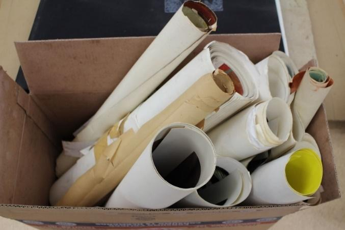
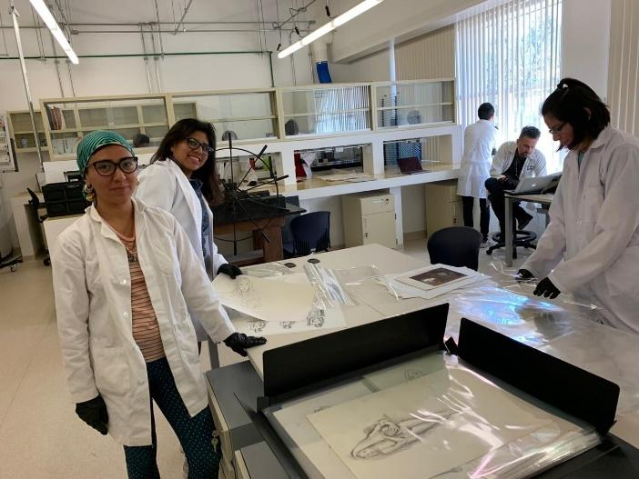
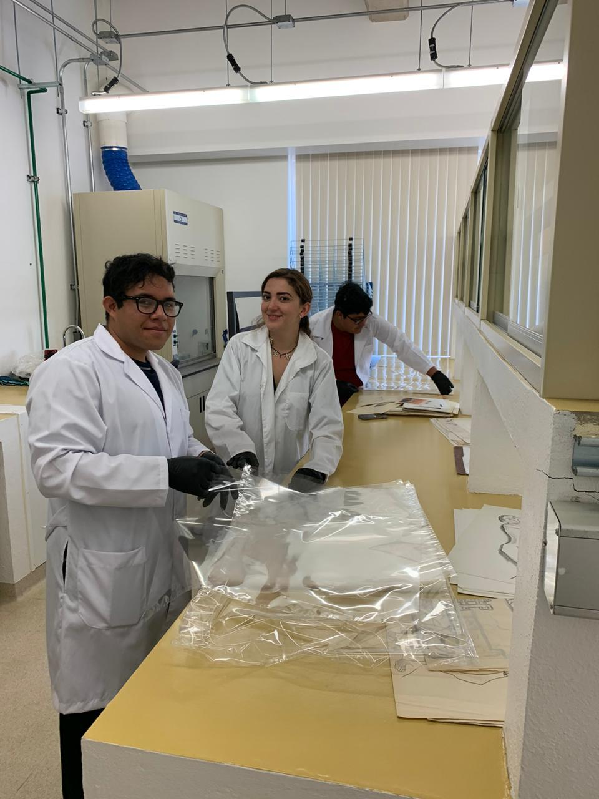

Alfredo Zalce Torres was an outstanding multifaceted artist and social thinker that was born in Pátzcuaro, Michoacán, México in 1908. Through his legacy, he shares sceneries, daily life, the activity of men and women; the progress of the time as well as popular traditions, among other elements. Considered one of the greatest Mexican muralists of the second half of the XX[^1] century, he was critical of the system and adhered to social causes, particularly, to the worker and farmers guild. He was part of the Universidad Michoacana of San Nicolás de Hidalgo (UMSNH) and he was the Dean of the Fine Arts School, as he was keen on teaching and helping others in the formative process. Zalce, who was once Diego Rivera’s disciple, is recognised as a founding member of the Revolutionary Writer Artists’ League (*Liga de Escritores Artistas Revolucionarios, LEAR)* and of the People’s Graphic Workshop (*Taller de Gráfica Popular*). Besides being a muralist and engraver, he had a run in sculpture, photography, ceramics, jewelry making, among other techniques (Pic. 1). He died at the age of 95 in 2003.

![Imagen 1. Alfredo Zalce[^7]](../02/image1.jpg)

P[^7]: Retrieved portrait of Alfredo Zalce: [<u>https://inba.gob.mx/prensa/13618/alfredo-zalce-renovador-de-la-grafica-mexicana</u> (15](https://inba.gob.mx/prensa/13618/alfredo-zalce-renovador-de-la-grafica-mexicana%20(15)th of May, 2022).

In 2014, the Alfredo Zalce Foundation and the National School of Higher Studies (*Escuela Nacional de Estudios Superiores, ENES*), along the Morelia Unit from the National Autonomous University of Mexico (Unidad Morelia), from the National Autonomous University of Mexico Universidad (UNAM) signed a collaboration agreement resulting in the transferring of private archives from the artist into the School; from that moment on, as part of the principles of ENES, it was considered that the teachers and students should work on the archive. In that way, the present document aims to share experiences that have been arising from the private archive of the artist Alfredo Zalce, which has also implied a rhizomatic approximation between archivists, historians, specialists in technology and matereality and, of course, in art.

The archive went through some vicissitudes, nevertheless, it has been a cornerstone in creating learning experiences that have resulted in the appropriation of this archive by the student body, while other specialists and scholars have had the chance to rediscover the artist, the forger. Zalce’s work, ultimately, brings back a time and space in Mexico marked by its social movements, working class fights and the need for education.

Today the private archive presents a series of challenges: How can we think about it and connect it with the artist and the archivist as well as with other disciplines? How can it be shared with others? In which way a digital depository could enhance dissemination and interconnection processes towards teaching and research? It is worth mentioning that these reflections are part of the axis for research that we have been developing in various projects, which have led us to conduct meetings with teachers, discussion groups with students, all part of the Archive Administration Degree; as well as students that have developed other researches involving the artist’s arthive in *Universidad Autónoma of San Luis Potosí*, providing and reflecting in the Lab’s observation and during the classes.

## On its arrival and first breakthroughs regarding the private archive 

Alfredo Zalce’s documents and various objects were transferred from the house where they were being kept to a reserved area in the School’s documentation center and they remained there for a while. As it happens in many of these cases, the reception of this archive did not undergo the best conditions, that is to say, a proper packaging and inventory did not happened and some of the boxes even had high levels of acidity in their paperboard (typically found in products that previously contained soap, eggs, toilet paper…), in spite of this situation, and beyond the dust and some spiderwebs, the documents were not severely affected.

For the organization, understanding the archivist's practice, as well as the descripting and cataloging process of a collection is not always easy. The first approach to Zalce’s documentation was made by the History of Art School, as it acknowledged its vast artistic value and knowledge. The previous, on one hand, triggered a series of dissemination activities and projects that enabled a first acquisition of its infrastructure to better safeguard the collection, but, on the other hand, it also involved that the first organizations were though in terms of the research, that is to say, the themes that were related to interests given by art itself. There was no conceptualization around the archive, nor a methodological approach in line with the archivist principles.

It was mid 2016 that the ENES authorities decided that such collection should be protected by the Administration of Archives and Documental Management Degree (AAyGD) for its organization, cataloging and overall management. The first works done are as it follows:

- Negotiations were carried out with authorities so that the School would assign a place that would serve as historical archive: *Sala* *Miantskuarhu.*[^2] Also, a Lab was assigned to execute stabilization works, guard development, inventory, digitalization, where Lab students and teachers could connect both for the creation of the archive as well as promoting the teaching-learning process. Relying on assigned spaces made the moving of the archive to a new place possible. It was a process that took months to organize and plan in which teachers, students and general service staff participated by placing the boxes (Pic 2 to 4)

 

-   It was necessary to create a committee integrated by representatives of the Foundation and School authorities in order to analyze and propose actions that would benefit the archive.

- Guidelines for the managment of Miantskuarhu Room and the Archivist Lab were approved (Pic. 5).

- The Academic Committee from the AAyGD Degree further agreed on having a subject of “Integration Workshop” based on the the learning projects associated to the Alfredo Zalce Archive (FAZ).[^3]

## Intervening the private archive 

In Mexican law what is related to private archives can be taken from Articles 75 to 77 as “private archives”, which are of public interest. If it doesn’t have a denomination, the law establishes that “private documents” are those “documents or archives which are relevant or of meaning for the knowledge of national history, by the criteria established by the National Council, considering as characteristic elements the documenting heritage of the Nation” (House of Representatives, 2018, p.20); so that whoever possess an archive of such nature must organize and preserve it, besides considering access strategies. The previous makes visible these other subjects[^4] that didn’t necessarily were subscribed before to that duty, as there was no clarity on their existence and conditions in which they were found.

On his behalf, Cruz Mundet defines the private archive as that which is “relative to a natural person or legal entity of private character” (Mundet, 2011, p. 83); that is to say, from this approach the documents are created by an individual or institution as the result of private functions; on the other hand, a familiar archive is considered to be that “relative to a family or family groups related to the individual, which turns out to be the result of a heritage, private or social management \[...\]” (*ibid*., p. 81). Clearly, one of the main differences between a private and a familiar archive rests in what we know as the producing entity. In the first, the individual is the sole producer of the documents, which makes it hard for the archivist to do the identification process and bring it together with multiple documental collections that may emerge. While in the familiar archive the producers can be two or more members regardless of the collection. This situation makes the “dividing line” between private and familiar archives blurry, at times even imaginary. What it can be stated is that both private as well as familiar archives are determining in the historical future of a society; it has the potential of being that other story -the non official- that serves to build the historical memory.

From the approaches to Zalce’s Archive and in the integrated work we did as a disciplinary team, we were able to understood the rhizomatic nature that these present, that is to say, how a document connects with others until it weave the subnetworks that link them together, in such way that these subnetworks keep up with something: intertwining with other artists and people, others even with other archives…[^5] an experience where both the archivist as the researcher become a key part.

In this documenting set, Zalce remains as the main axis, but if we pay attention to these roots and subnetworks the chances for knowledge are immense. Gilles Deleuze and Félix Guatarri in their work *Rizoma* (2004) trigger this way of doing and thinking things. The philosopher’s proposal is to go back to those knowledge that are not on the surface; that are not at plain sight. The rhizomes are those underground rootlets that emerge from the main root and displace underneath, making room for them to move to other places. The private archives -eventhough it may sound conflicting-, give us the chance to explore them beyond the subject itself and help us to pay attention to those rhizomes that connect with others; an exercise that we realized is more fruitful with the help of an interdisciplinary team.

Once Zalce’s archive works was shaped through the Integration Workshop, it was clear the chance to connect the teaching-learning process between students, as well as teachers, as now they have the chance to provide theoretical aspects related to the Archive hand in hand with its practical surroundings, and specifically to situations that they will encounter in work environments. The *in-situ* learning, thus, seeks to create experiences that are close to the real-life; it is expected for students to, individually or collectively, resolve as many challenges as doubts under the guidance of the teacher who accompanies the process and, to the extent possible, think the situation that students must face (Pic. 6 and 7). From this place, if the student asks for example, ‘can I take the staple from this picture?’, instead of the teacher answering positively or negatively, he/she/they has the opportunity to reply with questions that can follow a process of analysis on whether it is recommendable to take out such staple.

In the Bachelor's Degree, students have had the chance to discuss considerations that must be taken in consideration when working with records and the implementation of technologies. Particularly, in the case of digital repositories, where long conversations on how to incorporate such elements had happened as (a) reflect the artist’s personality; (b) are directed to a broad audience through dissemination, but without taking away the expert viewpoint that promote its study; and (c) provided digital contents to kindred networks that allow the FAZ to become accessible from various entry viewpoints in the digital esphere.

The work done with different groups of students in the Integration Workshops allow, from the original questioning, to project the digital repository FAZ, within an interdisciplinary exercise that connect records and computing, in a more accessible holding; the chance of a larger personalization per guest and increase the dynamism of the unfolding of its contents, being the automatized preservation of the information one of the main aspects that would allure new users based on their research interest or the study of an artist’s work.

This development line would allow the interested audience to reach multiples levels of depth from their own private interests, but the learning exercise on the topic has allowed students to propose and delimit -along the academic body-, strategies that from the creation of a depository enable this function, also allowing other digital generations within the repository to link the holding’s objects and materials with other multimedia objects of interest, that, at the same time, incorporate a pedagogical or dissemination overview that allow them to be part of new educational processes. In this way, students have come to the conclusion that the digital repository could reflect transcendental aspects from master Zalce’s personality in its calling as an artist and a guide.

## Closing thoughts 

Alfredo Zalce’s personal archive has been active for 5 years and it is currently managed by teachers, students, as well as guests and other interdisciplinary groups that have adhered to the project. The inventory and organizational works are about to conclude, which could result in the creation of a profile for the framework of classification.

Along this process, the experiences (with its advances and difficulties) have been meaningful for those who had experimented in the intervention of this archive. From our philosophy on *in-situ* learning, we are interested in highlighting certains elements that we believe that needs to be taken in consideration in the teaching-learning process, as both groups (students and teachers) hace experiences and resignifications that go beyond a course:

1. The School’s archival community has created a strong sense of appropriation towards the artist’s collection, many of them had their first contact just months after arriving at the documentation center, they have been a part of *Sala Miantskhuarhu*, and in its advances in the organization.

2. Teachers, and undoubtedly,students are satisfied to see that the “tasks”, “exercises” and “activities” that are made in the Archivist Lab are useful; that is to say, they have a “real purpose”. The last, creates a sense of satisfaction.

3. Teachers that already knew about Alfredo Zalce’s trajectory, now understand it in a different way, specially by being capable of identifying the connections between his collection and other collections (the rhizomatic viewpoint).

4. The *in-situ* learning results in an interdisciplinary teaching,as we can see in the integration of technologies and the recording for the creation of projects arising from concrete situations in FAZ.

5.  Students also acknowledge:

    - The relevance that every Bachelor’s Degree teacher gives to these type of experiences in the Lab[^5], even linking the contents with the *in-situ* learning.

    - The critical device that has been developed in terms of what “it should be done” and what is still missing, or has been implemented in the Lab’s archivist work. Similarly, they identify that at times the practices in these spaces, in regards to Zalce, can become “mechanized”, as an experience close to the social service, or to a working environment. The previous is far from the idea of an *in-situ* learning experience, and on the pedagogical context:

    - Though, most of them recognize it is key to learn about the archive, but overall, about the diversity of supports that characterize them; they also highlight the need to create other learning-teaching spaces besides Zalce’s that could offer other challenges.

## Consulted Sources 

–Cámara de Diputados (2018). Ley General de Archivos, recuperado en: [<u>https://www.diputados.gob.mx/LeyesBiblio/abro/lfa/LFA_abro_15jun18.pdf</u>](https://www.diputados.gob.mx/LeyesBiblio/abro/lfa/LFA_abro_15jun18.pdf) Consultado el 8 de mayo del 2022.

–Cruz Mundet, José Ramón (2011). *Diccionario de Archivística (con equivalencias en inglés, francés, alemán, portugués, catalán, euskera y gallego),* España, Alianza.

–Deleuze, Gilles y Félix Guattari. (2004). *Rizoma, introducción*, México: Ediciones Coyoacán.

[^1]: After the Mexican Revolution was done (1910-1917), José Vasconcelos, the face of the Public Education Secretariat (SEP), created on October 3, 1921, started a national project that would boost Mexican education and culture; these as a consequence of the high levels of illiteracy in the country which was connected to the social backwardness. He bet on teaching in a more accessible way, having more schools and teachers, and take education to rural spaces, and thinking these spaces as places to express history, development and positive things of the country… in that context is that art was connected. The previous, among other elements, promoted muralism exponentially through artists like Dr. Atl, Diego Rivera, José Clemente Orozco, David Alfaro Siqueiros, who would be considered the first wave of muralists (1920-1940). See: [<u>https://www.gob.mx/sep/acciones-y-programas/historia-de-la-secretaria-de-educacion-publica-15650?state=published</u>](https://www.gob.mx/sep/acciones-y-programas/historia-de-la-secretaria-de-educacion-publica-15650?state=published) (Retrieved the 10th of April, 2022).

[^2]: From purépech that means: Place for Memory.

[^3]: The AAyGD Bachelor’s Degree is made up of 8 semesters (4 years) and in it the students have to take the “Integration Workshop” (basic, intermediate and advanced) that seeks for the student to create an experience and/or project that connects to the other subjects at the time of studying; this aims to link theoretical and practical elements.

[^4]: "To any authority, entity, organ and body of the legislative, executive and judicial branches, autonomous bodies, political parties, trusts and public funds; as well as any individual, legal entity or trade union that receives and exercises public resources or performs acts of authority of the federation, federal entities and municipalities, as well as individuals or legal entities that have private archives of public interest" (Cámara de Diputados, 2018, p. 6).

[^5]: The case of Alfredo Zalce’s private archive is not the only one, nevertheless it is a clear example of how this collection can connect to the Historical Archive of the *Universidad Michoacana de San Nicolás de Hidalgo* as it is there where you can find his work files, or other historical archives of the entity that have documents from Zalce as well as for other national and international institutions that guard or/and acquired the work of the artist and which first ideas are in the ENES Morelia Archive.

[^6]: Particularly, teachers that because of what they teach don’t feel it is necessary to go the lab or haven’t been able to understand or implement in-situ learning processes.
