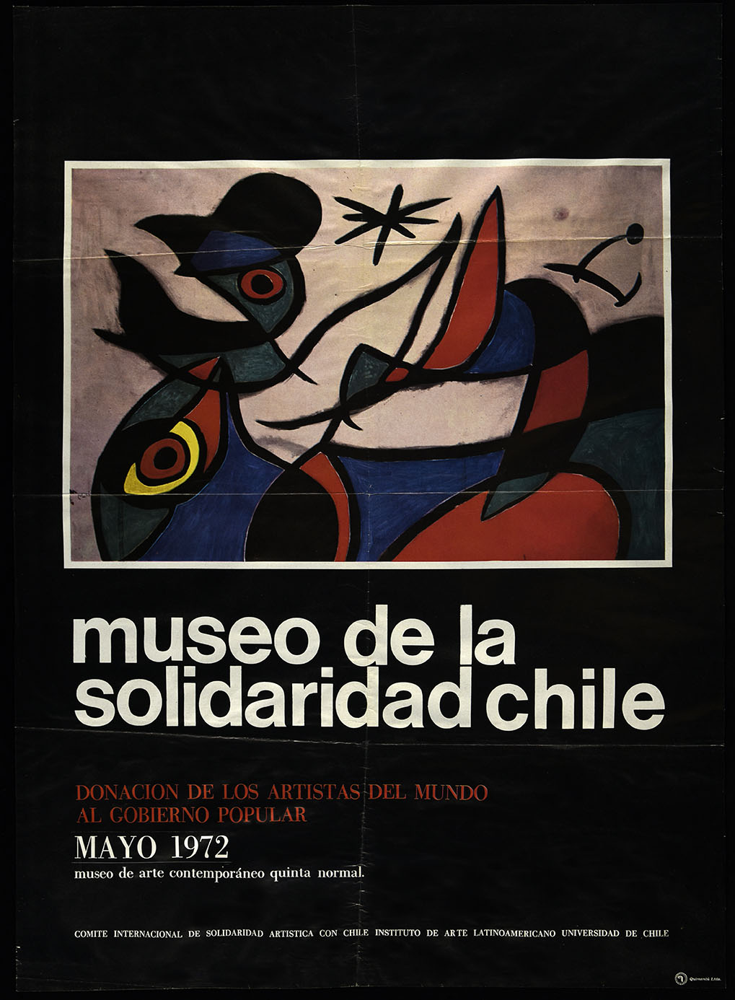
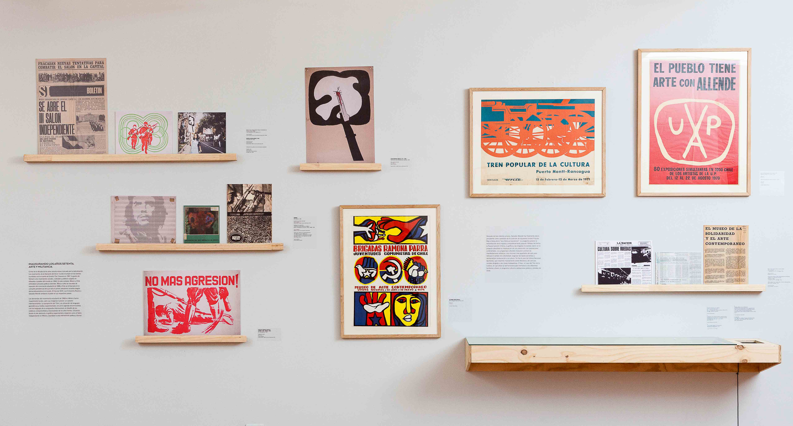

L'histoire du Musée de la Solidarité Salvador Allende (MSSA) est une histoire polyphonique, où convergent des pensées diverses, des réseaux de collaboration, d'affects et de résistance. Il s'agit d'un musée dont l'histoire et la collection d'art moderne et contemporain sont émouvantes, fondées sur la solidarité et la fraternité d'artistes, d'intellectuels, de femmes et d'hommes, qui ont défié de multiples contextes sociaux et politiques, parfois très hostiles, pour que ce projet unique au monde devienne une réalité et, plus encore, qu´il soit toujours d'actualité.

Cette rencontre internationale des archives d'art - qui donne lieu à la présente intervention - se déroule à un moment particulier, considérant que le 17 Mai de cette année, 2022, se célèbre le 50e anniversaire du musée. Le même jour, à Santiago du Chili, il y a 50 ans, dans le cadre d'un soutien international vertigineux et enthousiaste à l'Unidad Popular, la première exposition du Musée de la Solidaridad (MS) [^1] a lieu au Musée d´Art Contemporain, alors situé dans le Parc de la Quinta Normal, un projet réalisé grâce à un large réseau, tissé par des artistes, des amis et des collaborateurs tant au Chili qu'à l'étranger, et soutenu par le président Salvador Allende lui-même et tout l'appareil d'État.

Le musée, qui avait fonctionné pendant près de deux ans, organisé trois expositions et rassemblé quelques 670 œuvres, est brusquement suspendu après le coup d'État de 1973. La majeure partie de sa collection est alors cachée, certaines de ses œuvres disparaissent et son équipe fondatrice, politiquement engagée, fuit en exil.

En 1975, les tentatives de sauvetage des œuvres désormais possédées par la dictature sont toutes épuisées : les réseaux ayant rendu ce projet possible se reconstituent alors, non plus au Chili, mais à l'étranger, donnant naissance à la deuxième période du musée, à Cuba et en France : le Musée International de la Résistance Salvador Allende (MIRSA)[^2]. Cette fois-ci, l'objectif principal ne consiste plus en l'accompagnement du cheminement de la société chilienne vers le socialisme et en la création d´une collection d'art moderne et expérimental de premier ordre pour le peuple, mais vise à soutenir la résistance au Chili contre la junte militaire, et à conformer un témoignage direct des artistes et des intellectuels, ainsi qu'un instrument politique, financier et de propagande pour la résistance[^3].

Au cours de cette nouvelle période, qui dure presque quinze ans, les réseaux de solidarité créés à partir du Musée de la Solidarité intègrent de nouveaux agents, pays, pensées et intérêts, faisant de ce projet une odyssée, dont l'un des piliers est une Manager culturelle, Miria Contreras, la Paya, procédant à l’extension de ses réseaux et au tissage de nouvelles relations affectives, politiques et culturelles.

Le retour à la démocratie au Chili en 1990 marque une nouvelle étape, avec l'inauguration du Musée de la Solidarité Salvador Allende (MSSA) sous la direction d'une autre femme, Carmen Waugh, galeriste et Manager culturelle qui avait joué un rôle important dans l'équipe du MS des années auparavant. Sa gestion active non seulement le processus de retour des plus de mille œuvres données par des centaines d'artistes à l'étranger, mais permet également le retour des Archives, une mémoire à voix multiples, produite en différents lieux et chérie par ses nombreux dépositaires.

Mais ce n'est qu'en 2013 que ces archives révisées et protégées sont officialisées, et deviennent alors l'un des cinq départements centraux de l'organigramme de notre Musée actuel. Je le souligne car croire que les archives doivent constituer l'un des axes centraux de l'organisation d'une institution muséale n'est pas une pensée courante au Chili, du moins il y a dix ans, et c'est pour cela que la vision de l'avenir de la direction actuelle du Musée a été déterminante, reposant sur trois actions clés: injecter des ressources, financer des ressources humaines et placer les archives au même niveau que la Collection.

La première étape consiste en la formation d'une équipe de travail interdisciplinaire pour commencer l'organisation et la systématisation de cette collection, afin qu'elle soit conservée, cataloguée et, surtout, accessible. Cependant, la lecture d'écrits et l'examen de photographies ou d'archives audiovisuelles, suscitent chez nous des interrogations, mais surtout une urgence et un désir de reconstitution de l'histoire de ce musée ayant rassemblé et mobilisé de nombreuses personnes. Nous avons, à cette époque, besoin de connaître les raisons, les formes, les processus, les difficultés, les contextes et aussi les affects impliqués dans ce projet, ayant rendu possible l'impossible et ayant servi de modèle pour d'autres expériences de musées et de collections internationales, constituées sur la base de la solidarité, comme ce fut le cas avec _l'exposition internationale d'art pour la Palestine_ en 1978 ou l'initiative _Art pour le peuple du Nicaragua_ en 1981 ou encore la _collection d'art contre l'apartheid_ en Afrique du Sud en 1979[^4].

### Le cas mexicain

En 2015, parallèlement à l'exécution des processus d'archivage de notre fonds documentaire, nous créons un modèle de recherche à grande échelle qui allait non seulement nous permettre de mieux nous connaître, mais aussi de réactiver plusieurs des réseaux de collaboration créés ou ravivés dans les années 1970 et 1980. Il s´agit d'un modèle en dialogue avec les processus de formation de notre collection, et comme elle a été donnée presque entièrement par le biais d'envois de pays, tant dans la période MS que dans la période MIRSA, nous avons convenu que ce serait la manière d'aborder chaque projet de recherche : reconstruire les dialogues, les liens et les contextes entre le Chili et le pays donateur. Dès le départ, nous prenons la décision, en équipe, que le modèle de recherche à appliquer doit inclure non seulement une collecte et une révision documentaire exhaustive, tant au Chili que dans le pays à aborder, mais aussi des sources orales, des entretiens et la tenue de tables rondes avec la participation d'artistes, de gestionnaires et de personnes ayant participé à la création et à l'évolution du musée dans ses différentes étapes. Une méthodologie qui implique une double intention : d'une part, connaître les coulisses de ces dons, mais aussi intégrer de nouveaux supports, réflexions et lectures dans les archives.

Et nous avons alors de la chance, beaucoup de chance. Notre premier projet de recherche concerne le Mexique, le tout premier pays à avoir fait don d'œuvres à la SEP. En novembre 1971, l'exposition du premier envoi mexicain au Musée[^5] se tenait déjà au Molino de Santo Domingo à Mexico. Et quand je dis que nous avons eu de la chance, je le dis parce que des contextes, des situations et des personnes ont coïncidé, ce qui a permis au projet de se dérouler d'une très bonne manière, ayant permis la création de nouveaux réseaux de collaboration.

Un autre des points sur lequel nous nous mettons d'accord lors de la conception de ce modèle consiste en compter sur des professionnels externes pour effectuer la recherche au niveau de la révision, de l'analyse et de l'interprétation historique, et nous reconnaissons la nécessité de  nous associer à une institution culturelle dans le pays à étudier. Il y a deux raisons à cela : la première, parce qu'un projet de ces caractéristiques et de cette envergure est impossible à réaliser seul, en termes de ressources économiques et humaines, à laquelle s'ajoute notre désir d'intégrer de nouvelles perspectives et lectures dans la recherche. La deuxième raison, peut-être la plus importante, est que le Musée, tout au long de son histoire, a toujours eu une institution culturelle complice avec laquelle dialoguer, demander de l'aide et partager des expériences, dans les différents pays depuis lesquels il a reçu des œuvres et a fonctionné.

L'institution avec laquelle nous nous associons et impliquons alors pour ce premier projet possède déjà une importante trajectoire en matière d'archives d'art et de travail de recherche, nous parlons donc le même langage : il s´agit du Musée Universitaire d´Art Contemporain de la UNAM (Université Nationale Autonome du Mexique), le MUAC.

Au nom de cette institution, la conservatrice et actuelle directrice du MUAC, Amanda de la Garza, et le conservateur et historien de l'art Luis Vargas Santiago, qui était à l'époque directeur adjoint des programmes publics de cette institution, rejoignent le projet. Je suis pour ma part en charge de la coordination du projet et ils dirigent les recherches. Les mois d'exécution sont ardus et intenses, car nous disposons d'un temps limité pour le réaliser, et le projet est également encadré par le 25e anniversaire du rétablissement des relations diplomatiques entre le Chili et le Mexique, ayant eu lieu en 2015. Cela signifie donc que le travail de collecte et de révision des archives dans les deux pays est  mené en parallèle.

L ́étape suivante de ce processus consiste en la réalisation d'entretiens avec des artistes, des gestionnaires et des intellectuels appartenant aux réseaux affectifs, politiques et culturels de l'époque, tant au Mexique qu'au Chili, ainsi qu'en la tenue de deux tables rondes organisées dans les bureaux de la Fundación Alumnos 47 au Mexique. Les tables rondes, l'une politique et l'autre artistique, composées de militants, d'activistes et de politiciens chiliens et mexicains qui se trouvaient au Chili pendant ces années-là, et d'artistes ayant été donateurs pendant la période du MS et du MIRSA respectivement, cherchent, à travers des archives et des images de l'époque, à activer la mémoire, à redécouvrir un chapitre de leur propre histoire, à partager des histoires et même à comprendre les motivations à l´origine de certaines décisions. Ce dialogue réflexif permet également de découvrir qu'il s'agit d'une instance extrêmement précieuse pour ce type de recherche et qu'elle devrait être présente dans les projets futurs, car elle présente des voix, des contextes et des expériences différents du même événement.

Les résultats de la recherche sont alors mis en lumière dans le cadre d'une exposition qui s'est tenue au Mexique (MUAC) et au Chili (MSSA), presque en parallèle, et qui comprend des œuvres, des archives, des entretiens et des capsules audiovisuelles ; les conclusions de la recherche donnent aussi naissance à une publication, ainsi qu' à une sélection d'archives étudiées dans les deux pays et des images des œuvres de la collection mexicaine du MSSA, et à un atelier sur les expositions d'archives donné par Luis Vargas. En plus de mener cette recherche, nous sortons les archives du kardex et des vitrines, en explorant de nouvelles formes d'activation.

Le caractère enrichissant du projet repose dans le fait que, bien que nous voulions apprendre et approfondir l'histoire de notre institution, le processus constitue également une grande expérience d'apprentissage pour nos collègues mexicains autour de la production artistique de l'époque, les réseaux et les agents impliqués, et comment ces actions ont eu des répercussions et un impact sur une dimension artistique, culturelle et politique dans leur propre territoire.

### Le cas cubain 

Le deuxième cas de recherche que je souhaite exposer est celui de Cuba, diamétralement différent de celui du Mexique. Cuba a été un pays crucial pour le Musée dans sa première période, mais surtout dans la seconde, puisque c'est depuis La Havane que le MIRSA s'est articulé en 1975, sous la direction de Miria Contreras, en dialogue avec les collaborateurs qui étaient à Paris.

Selon la même logique que celle issue du modèle appliquée dans cas mexicain, nous cherchons un professionnel pour effectuer la recherche et une institution avec laquelle nous associer. Ce n'est pas une tâche facile ; les liens et les réseaux qui existent entre le musée et Cuba n'avaient pas été rétablis depuis des années, et rétablir cette confiance avec un pays prudent et méfiant à l'égard de son histoire n'est pas être facile, en plus de toutes les complexités de communication qui existent à l'époque sur l'île et qui persistent encore. N'ayant aucun contact ni aucune relation avec des chercheurs cubains, nous choisissons de travailler avec une personne qui connaît parfaitement l'histoire du musée, ou du moins une bonne partie de celle-ci, et qui possède la sensibilité nécessaire pour s'aventurer sur un terrain inconnu mais fascinant, l'historienne de l'art chilienne Carla Macchiavello, basée à New York.

Le plus difficile repose alors sur le fait de trouver l'institution avec laquelle établir ou plutôt rétablir une relation. Le centre d'opérations à partir duquel Miria Contreras a promu et coordonné MIRSA à Cuba est la Casa de las Américas, une institution culturelle renommée fondée par la guérillera et politicienne cubaine Haydée Santamaría en 1959, et dont les relations avec les arts visuels au Chili étaient étroitement liées depuis le milieu des années soixante, avec la participation d'artistes chiliens en tant que jurés à l'exposition de La Havane. Ces liens se sont resserrés avec la faculté d'art de l'université du Chili à partir de 1967, lorsqu'elle est devenue le principal interlocuteur de Casa.

Il nous faut plusieurs mois de travail acharné entre 2016 et 2017 pour trouver un moyen de rejoindre la Casa de las Américas. Il existe de la méfiance, plusieurs blessures à panser et des relations institutionnelles à réparer. La participation du designer et artiste chilien Hugo Rivera-Scott, exilé à Cuba entre 1979 et 1992 et a travaillé dans l'atelier de sérigraphie de la Casa, est essentielle pour initier ce processus de récupération. Une fois encore, les réseaux du passé jouent un rôle important dans la construction des réseaux du présent et du futur.

Avec un financement très restreint, nous commençons le projet avec le soutien de la Casa de las Américas, principalement celui de son président de l'époque, Roberto Fernández Retamar, de la directrice de l'Archivo Memoria, Silvia Gil, de la directrice du département des arts visuels Silvia Llanes, ainsi que de l'artiste Lesbia Vent Dumois, qui avait été directrice des arts visuels dans les années 1980, et de Chiki Salsamendi, qui a également travaillé à la Casa pendant ces années. Grâce à eux, nous pouvons pénétrer dans les archives et la mémoire de l'institution, dont l'accès était hautement protégé. Nous organisons de nombreux voyages à La Havane pour nous plonger dans les documents, mener des entretiens, comprendre leurs modes de fonctionnement et les affects les sous-tendant. Nous organisons également une table ronde avec la participation des personnes précédemment mentionnées, ainsi que d'artistes cubains et chiliens ayant fait l'expérience directe de l'affect et de la fraternité du peuple cubain avec les exilés. Cette instance, comme dans le cas précédent, a été activée par des archives, des images de la collection et des questions modérées par l'équipe MSSA et par la chercheuse.

Cependant, le temps que nous a pris la réalisation de ce projet est bien supérieur à ce que nous avions prévu. Nous y travaillons depuis cinq ans et espérons lancer la publication de ce voyage fascinant à la fin de l'année 2022. L'attente n'a pas été vaine, le temps investi dans la reconstruction de ces liens a porté ses fruits et nous a réservé des surprises. L'une d'entre elles a surgi lors de notre avant-dernier voyage  à La Havane avec l'équipe de recherche. Lors de l'une des réunions que nous avons tenues à la Casa de las Américas, nous avons visité une partie de ses installations et dans l'une d'elles, dans la salle de conservation, nous avons trouvé sur l'étagère supérieure de certaines étagères un groupe de boîtes avec le nom "Lesbia's Boxes" écrit dessus au marqueur. Lesbia Vent Dumois avait été directrice du département des arts plastiques de Casa au moment où Miria Contreras a fait son entrée au sein de l'institution. Ce qui est incroyable dans cette découverte, c'est que des mois plus tard, nous allions découvrir ce que ces boîtes contenaient : des centaines d'archives, y compris des documents et des photographies, qui abritent une partie des origines et de la mémoire de MIRSA, ayant été produites et sauvegardées par Miria Contreras lorsqu'elle travaillait à la Casa de las Américas. Des pièces documentaires qui, grâce à la générosité de cette institution complice, se trouvent désormais dans nos archives.

L'enseignement que nous pouvons partager aujourd'hui de notre expérience de recherche est que ces projets n'ont pas seulement été un voyage dans le passé pour reconstruire notre histoire et mettre en lumière les voix qui ont été oubliées ou dont nous ne nous sommes pas souvenus pour leur action rélle, mais aussi la possibilité de travailler à nouveau en collaboration et de tisser de nouveaux réseaux de fraternité, d'art et de politique, aujourd'hui.

<!-- Footnotes themselves at the bottom. -->
## Notes

[^1]:
Zaldívar, C. (Ed.). (2013). 40 ans du Musée de la Solidarité pour le Chili, fraternité, art et politique 1971-1973.  Musée de la Solidarité Salvador Allende.

[^2]:
Yasky, C. & Zaldívar, C. (Eds.). (2022). Musée International de la Résistance Salvador Allende 1975- 1990. Éditions MSSA.

[^3]:
Contreras, M. (décemre). Appel à projet pour artistes. Création. MIRSA. Archives du Musée de la Solidarité Salvador Allende. [https://archivo.mssa.cl/Detail/objects/35](https://archivo.mssa.cl/Detail/objects/35)

[^4]:
Khouri, K. & Salti, R. (Eds.). (2018). Past Disquiet, Artist, International Solidarity and Museums in Exile (Museum under Construction). Museum of Modern Art in Warsaw.

Exposition _Pasado Inquieto_. (2018).Musée de la Solidarité Salvador Allende  https:/[/ww](http://www.mssa.cl/exposicion/pasado-inquieto/)w[.mssa.cl/exposicion/pasado-inquieto/](http://www.mssa.cl/exposicion/pasado-inquieto/)

[^5]:
Catalogue: Los artistas del mundo al Pueblo de Chile. 1er envoi mexicain., Musée d´Art Moderne de Santiago de Chile, Exposition Molino de Santo Domingo. (1971, 26 de noviembre). Archives du Musée de la Solidarité Salvador Allende  . https://archivo.mssa.cl/Detail/objects/3523
